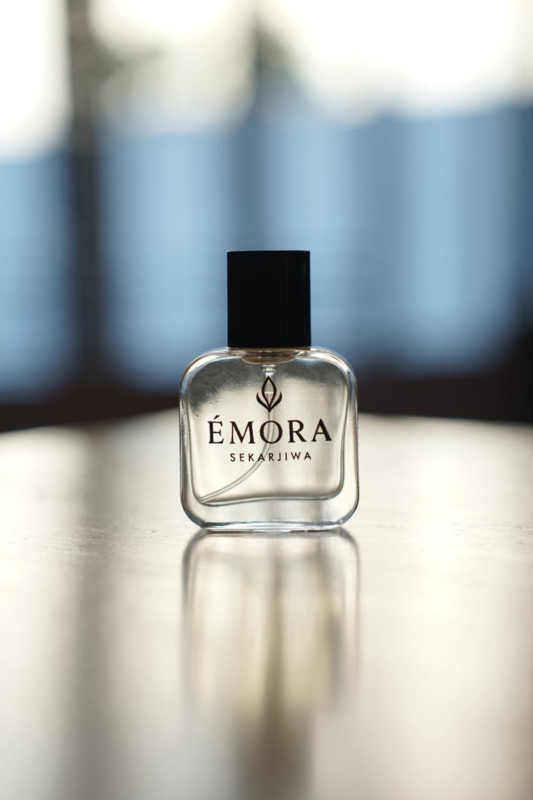

# 📸 Panduan Upload Foto Produk EMORA

## 🎯 Cara Menggunakan Folder Assets

Website EMORA sudah siap untuk menerima foto produk Anda. Berikut panduan lengkap:

---

## 📁 Struktur Folder

```
Emora-website/
├── assets/
│   ├── images/
│   │   ├── products/        ← Upload foto produk di sini
│   │   ├── hero/           ← Upload background hero di sini
│   │   ├── about/          ← Upload foto about section di sini
│   │   └── README.md
│   ├── index.html
│   ├── style.css
│   └── script.js
```

---

## 🖼️ Langkah-Langkah Upload Foto

### **Step 1: Siapkan Foto Produk**

Buat/ambil 7 foto untuk produk:
1. belle-fleur.jpg
2. dots-vanille.jpg
3. lumer-citrus.jpg
4. be-influencer.jpg
5. royale-amber.jpg
6. nuit-elixir.jpg
7. velvet-oud.jpg

**Spesifikasi Foto:**
- **Format:** JPG, PNG, atau WebP
- **Ukuran:** 600x800px atau 400x500px
- **Ukuran File:** Max 1-2MB (lebih kecil = loading lebih cepat)
- **Background:** Putih atau transparent (untuk aesthetic luxury)
- **Lighting:** Terang dan professional

### **Step 2: Kompresi Foto (Penting!)**

Gunakan tool online gratis ini untuk kompresi:
- **TinyPNG:** https://tinypng.com/
- **Squoosh:** https://squoosh.app/
- **ImageOptim:** (Mac) atau Caesium (Windows)

**Tips Kompresi:**
- Ukuran foto harus < 500KB untuk performa optimal
- Jangan sampai terlalu kecil kualitasnya
- Format WebP lebih kecil dari JPG

### **Step 3: Upload ke Folder**

1. Buka folder: `d:\Emora-website\assets\images\products\`
2. Paste semua 7 foto produk ke sini
3. Pastikan nama file sesuai dengan list di atas (huruf kecil, gunakan dash `-`)

Contoh struktur yang benar:
```
products/
├── belle-fleur.jpg
├── dots-vanille.jpg
├── lumer-citrus.jpg
├── be-influencer.jpg
├── royale-amber.jpg
├── nuit-elixir.jpg
└── velvet-oud.jpg
```

### **Step 4: Upload Foto Lainnya (Optional)**

#### **For Hero Section:**
- Upload ke: `assets/images/hero/`
- Nama file: `hero-banner.jpg`
- Ukuran: Min 1920x1080px (Full HD)
- Bisa background texture atau pattern

#### **For About Section:**
- Upload ke: `assets/images/about/`
- Nama file: `about-collection.jpg`
- Ukuran: 600x600px hingga 800x800px
- Bisa foto koleksi atau brand story

### **Step 5: Test Website**

1. Buka `index.html` di browser
2. Foto seharusnya muncul di masing-masing section
3. Jika foto tidak muncul, check:
   - Nama file sudah benar?
   - Path folder sudah benar?
   - Format foto didukung? (JPG, PNG, WebP)

---

## 🎨 Rekomendasi Editing Foto

Untuk hasil terbaik, edit foto menggunakan tool seperti:
- **Canva:** https://www.canva.com/ (free, online)
- **GIMP:** https://www.gimp.org/ (free, install)
- **Photopea:** https://www.photopea.com/ (free, online)

**Edit Tips:**
- Crop ke ukuran yang sesuai
- Tingkatkan contrast dan brightness
- Tambah shadow/glow effect
- Remove background jika perlu

---

## 📋 Naming Convention Reference

**Catatan:** Gunakan format ini untuk consistency:

| Produk | Nama File | Path |
|--------|-----------|------|
| Belle Fleur | `belle-fleur.jpg` | `assets/images/products/` |
| Dots Vanille | `dots-vanille.jpg` | `assets/images/products/` |
| Lumer Citrus | `lumer-citrus.jpg` | `assets/images/products/` |
| Be Influencer | `be-influencer.jpg` | `assets/images/products/` |
| Royale Amber | `royale-amber.jpg` | `assets/images/products/` |
| Nuit Elixir | `nuit-elixir.jpg` | `assets/images/products/` |
| Velvet Oud | `velvet-oud.jpg` | `assets/images/products/` |

---

## ⚙️ Update HTML (Jika Perlu)

HTML sudah ter-setup untuk menggunakan foto dari folder assets:

```html
<div class="product-image">
    
    <div class="placeholder-product">Belle Fleur</div>
</div>
```

**Fitur:**
- `src=`: Path ke foto
- `alt=`: Deskripsi foto (untuk SEO & accessibility)
- `onerror=`: Jika foto tidak load, akan hide img tag tapi placeholder tetap tampil

---

## 🔒 Tips Penting

✅ **DO:**
- Gunakan foto berkualitas tinggi
- Kompresi sebelum upload
- Gunakan nama file yang jelas dan konsisten
- Backup foto original Anda
- Update alt text yang deskriptif

❌ **DON'T:**
- Upload foto > 3MB
- Gunakan nama file dengan spasi atau karakter aneh
- Lupa backup foto
- Upload foto dengan resolusi terlalu rendah
- Ubah struktur folder secara random

---

## 🆘 Troubleshooting

### **Foto tidak muncul**
- Check: Nama file sudah benar? (case-sensitive)
- Check: Path folder sudah benar?
- Check: Format file supported? (JPG/PNG/WebP)
- Refresh browser (Ctrl+F5 / Cmd+Shift+R)

### **Foto loading lambat**
- Rekompresi foto
- Gunakan format WebP
- Kurangi ukuran dimensi
- Optimize image dengan TinyPNG

### **Placeholder masih terlihat**
- Jika foto tidak load, placeholder akan tetap tampil
- Pastikan foto benar-benar di folder yang tepat
- Cek console browser (F12) untuk error messages

---

## 📱 Responsive Images (Advanced)

Untuk performa mobile yang lebih baik, bisa setup responsive images:

```html

```

Ini akan otomatis load gambar yang lebih kecil di mobile device.

---

## 📊 File Size Reference

Ukuran file yang recommended untuk performa optimal:

- Product Image: 150-300 KB
- Hero Banner: 300-500 KB
- About Image: 150-250 KB

**Total optimized: < 3 MB untuk semua assets**

---

## ✨ Result

Setelah upload semua foto dengan benar, website Anda akan terlihat:
- Professional
- Luxury & Premium
- Load cepat
- Responsive di semua device

---

**Happy uploading! 📸✨**

*Last Updated: March 2026*
